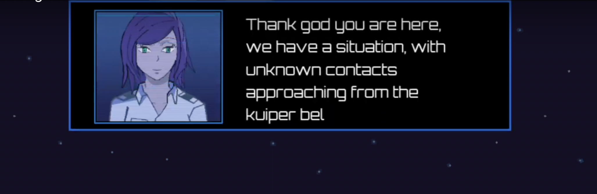
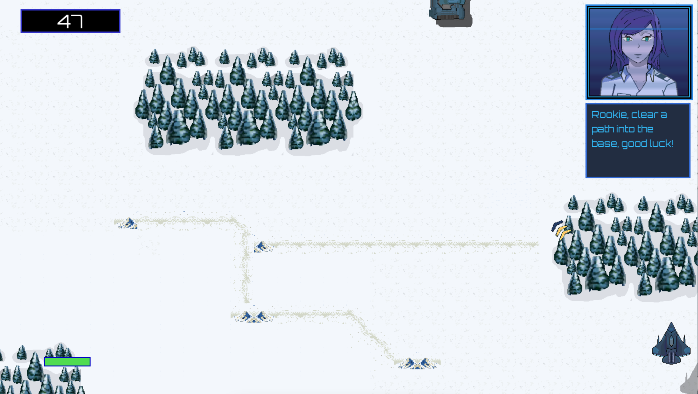
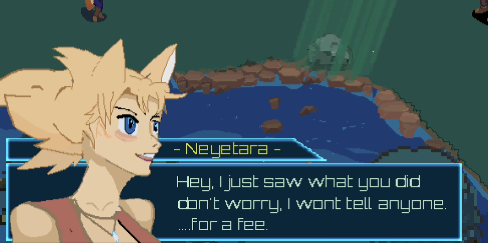
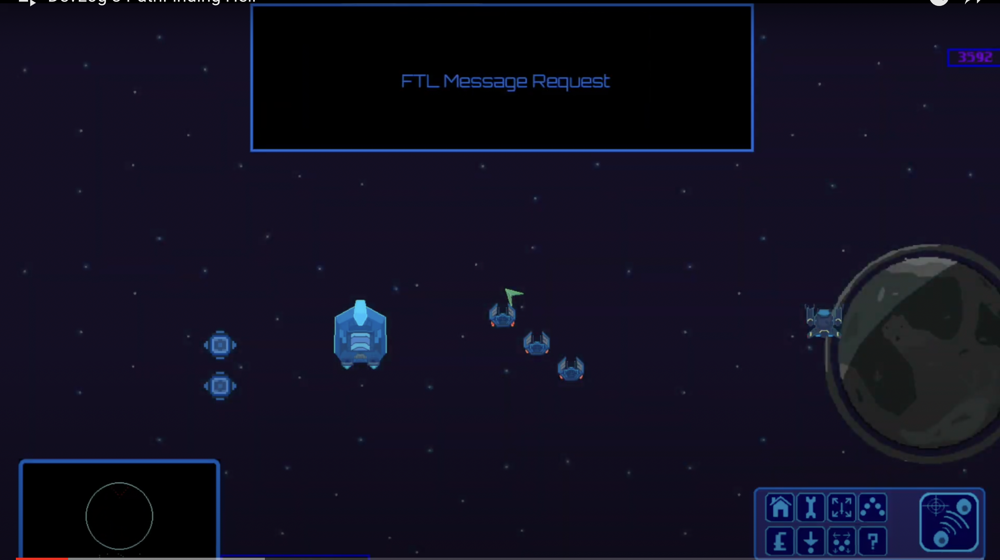
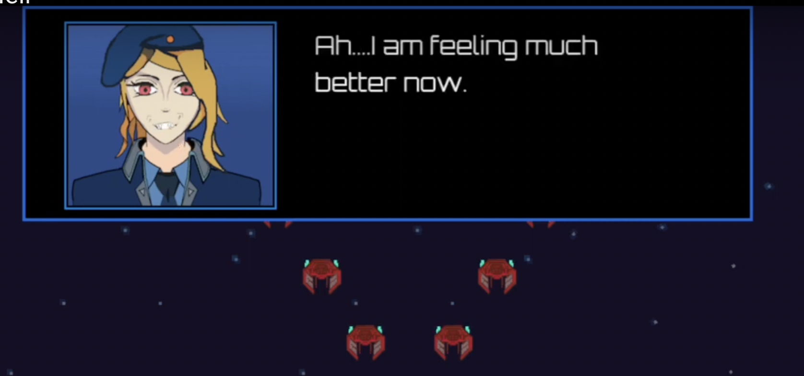
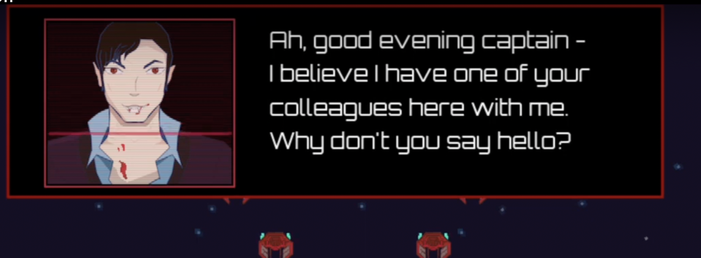

# CUTSCENE MANAGER

This code implements a cutScene class in the game engine, using Pygame. The cutScene class is used for displaying different types of in-game notifications, such as incoming alerts and reinforcement notifications. The class contains attributes and methods that are used for managing the display of the notifications on the screen. The different attributes store information such as the position and size of the notification window, the themes and colors used to display the notifications, the animations and sounds played when the notifications appear, and the text displayed in the notifications. The runCutScene method is used to open the dialogue window and display the notifications.

# EXAMPLES FROM MY GAME PROJECTS

Feel free to check out my youtube channel for more or my games in the works [https://www.youtube.com/channel/UCdiVvGa0AewSRIIJVxMji4w](https://www.youtube.com/channel/UCdiVvGa0AewSRIIJVxMji4w)

## Steel Spririt 

A free-roam scroller hybrid shooter. 

## Alteria  

An old school RPG with beatemup elements.   

## Drone Commander 
  
A command and conquer meets starcraft strategy with a twist.  

# NOTE 

The code hasn't been commented, versioned yet and I need to add the supporting classes - if you are in a hurry, email me at murchie85@mgail.com and I will send you the full dump, otherwise i'm tidying it up first. 

